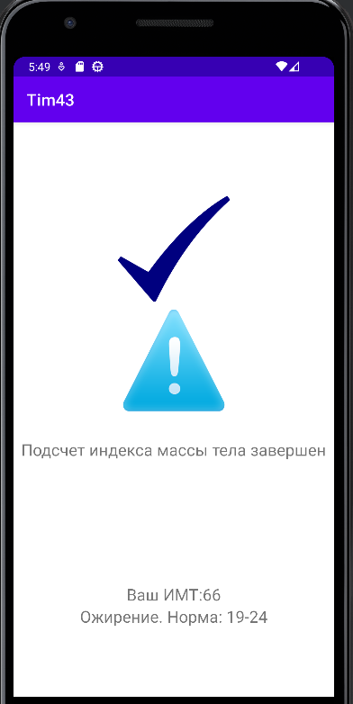
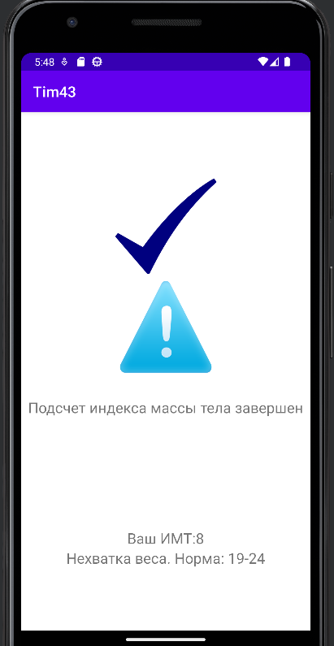
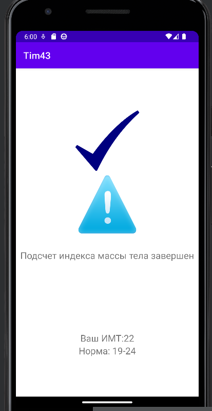

# BMI

   if(res<=19 &&age>=19 &&age<=24) tvNormal.setText("Нехватка веса. Норма: 19-24");
   
        if(res>=24 &&age>=19 &&age<=24) tvNormal.setText("Ожирение. Норма: 19-24");
        if(res<=25 &&age>=25 &&age<=34) tvNormal.setText("Нехватка веса. Норма: 20-25");
        if(res>=34 &&age>=25 &&age<=34) tvNormal.setText("Ожирение. Норма: 20-25");
        if(res<=35 &&age>=35 &&age<=44) tvNormal.setText("Нехватка веса. Норма: 21-26");
        if(res>=44 &&age>=35 &&age<=44) tvNormal.setText("Ожирение. Норма: 21-26");
        if(res<=45 &&age>=45 &&age<=54) tvNormal.setText("Нехватка веса. Норма: 22-27");
        if(res>=54 &&age>=45 &&age<=54) tvNormal.setText("Ожирение. Норма: 22-27");
        if(res<=55 &&age>=55 &&age<=64) tvNormal.setText("Нехватка веса. Норма: 23-28");
        if(res>=64 &&age>=55 &&age<=64) tvNormal.setText("Ожирение. Норма: 23-28");
        if(res<=23 &&age>=65) tvNormal.setText("Нехватка веса. Норма: 23-28");
        if(res>=28 &&age>=65) tvNormal.setText("Ожирение. Норма: 23-28");

        if(age>=19 &&age<=24 &&res>=19 &&res<=24) tvNormal.setText("Норма: 19-24");
        if(age>=25 &&age<=34 &&res>=25 &&res<=34) tvNormal.setText("Норма: 20-25");
        if(age>=35 &&age<=44 &&res>=35 &&res<=44) tvNormal.setText("Норма: 21-26");
        if(age>=45 &&age<=54 &&res>=45 &&res<=54) tvNormal.setText("Норма: 22-27");
        if(age>=55 &&age<=64 &&res>=55 &&res<=64) tvNormal.setText("Норма: 23-28");
        if(age>=65 &&res>=24 &&res<=29) tvNormal.setText("Норма: 24-29");
   
